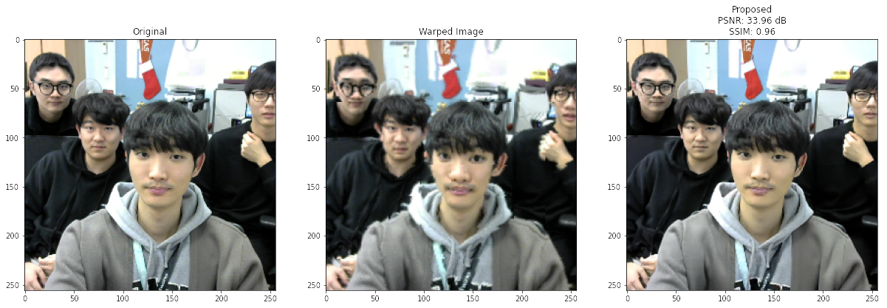

## Abstract
Semantic communication systems aim to enhance transmission efficiency by leveraging deep neural networks to learn conditional probability distributions, which effectively captures the semantics of the data, for the joint optimization of source and channel coding. However, these systems often overlook the intrinsic diverseness in the importance of input data elements (e.g., individual pixels in an image), disregarding established principles of entropy and variable-length coding that are fundamental to modern data compression algorithms. To address these limitations, we introduce an adaptive spatial zooming and unzooming module that selectively focuses on "hard-to-encode" pixels while de-emphasizing "easy-to-encode" ones. In doing so, we integrate an information-theoretic perspective into semantic communication systems. We also validate our system's performance through a wireless transmission testbed.

## System Setup
<figure>
   
  <figcaption>
    Overall architecture of the proposed zooming-based semantic communications system.
  </figcaption>
</figure>

We added a importance-based zooming module and unzooming module to the Vision transformer and convolutional neural network-based semantic communications system. We then conducted real-time wireleess transmission of the neural encoded symbols using the NI USRP software-defined radio device. For the detailed explanation of the neural network architecture and the wireless testbed, please refer to our [previous work](https://github.com/kmsiapps/Semantic-Communications-with-a-Vision-Transformer).

We plan to demonstrate real-time wireless transmission of the selfie with the proposed system and our semantic communications testbed at the IEEE GLOBECOM 2023.

## Examples
<figure>
   
  <figcaption>
    Example images from the proposed system.
  </figcaption>
</figure>

Each image corresponds to the original, zoomed, reconstructed image, respectively. We assumed AWGN channel with 10 dB SNR.